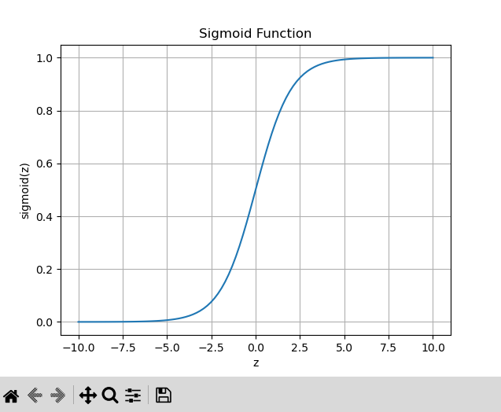
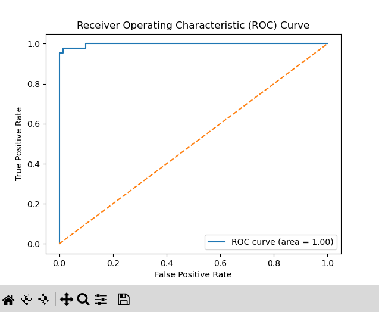
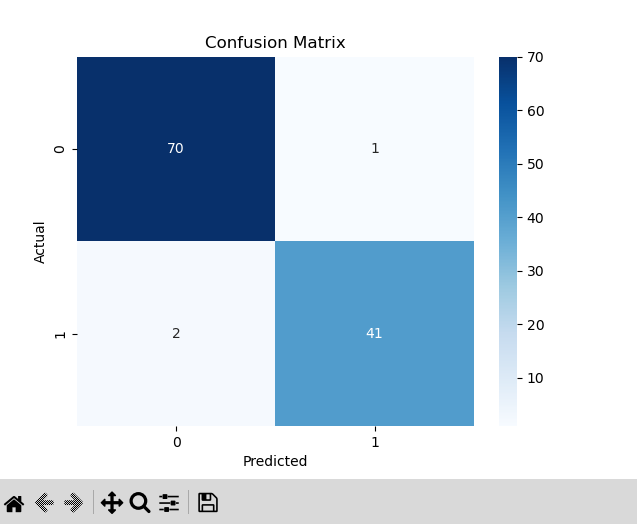

# Logistic Regression on Breast Cancer Dataset

## Objective
Build a binary classifier using Logistic Regression on the Breast Cancer Wisconsin dataset to classify tumors as malignant or benign.

---

## Tools & Libraries
- Python
- Pandas
- Scikit-learn
- Matplotlib
- Seaborn

---

## Dataset
- **Source:** [Scikit-learn Breast Cancer Dataset](https://scikit-learn.org/stable/datasets/toy_dataset.html#breast-cancer-dataset)
- The dataset contains features computed from digitized images of breast mass and a diagnosis column (`M` for malignant, `B` for benign).

---

## Steps Performed
1. **Data Preprocessing**
   - Encoded target variable (`M` → 1, `B` → 0)
   - Removed irrelevant columns
   - Standardized features for uniformity

2. **Model Building**
   - Used `LogisticRegression` from `sklearn.linear_model`
   - Trained the model on 80% of the data, tested on 20%

3. **Evaluation**
   - Confusion Matrix
   - Precision, Recall, F1-Score
   - ROC Curve and AUC
   - Sigmoid function visualization

---

## Results
- **Accuracy:** ~97%
- **Precision:** 97.6%
- **Recall:** 95.3%
- **F1-Score:** 96.4%
- **ROC-AUC Score:** 1.00  
- The classifier demonstrated high performance and excellent generalization on unseen data.

---

## Visualizations

### 1. Sigmoid Function  
  
The sigmoid curve demonstrates how logistic regression maps any real-valued number into a probability between 0 and 1. It’s essential for understanding how predictions are interpreted in binary classification.

---

### 2. ROC Curve  
  
The Receiver Operating Characteristic (ROC) curve shows the model's performance across all classification thresholds. An AUC of 1.00 indicates perfect classification ability, with a very high true positive rate and low false positive rate.

---

### 3. Confusion Matrix  
  
This heatmap shows that out of the predictions, 70 benign and 41 malignant tumors were correctly classified, while only 3 misclassifications occurred. It visually confirms the model's high accuracy.

---

## How to Run
```bash
# Install dependencies
pip install pandas scikit-learn matplotlib seaborn

# Run the script
python breast_cancer_logistic_regression.py
