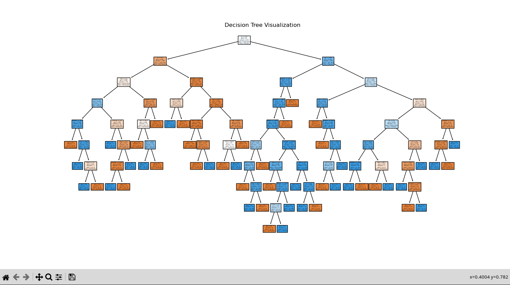
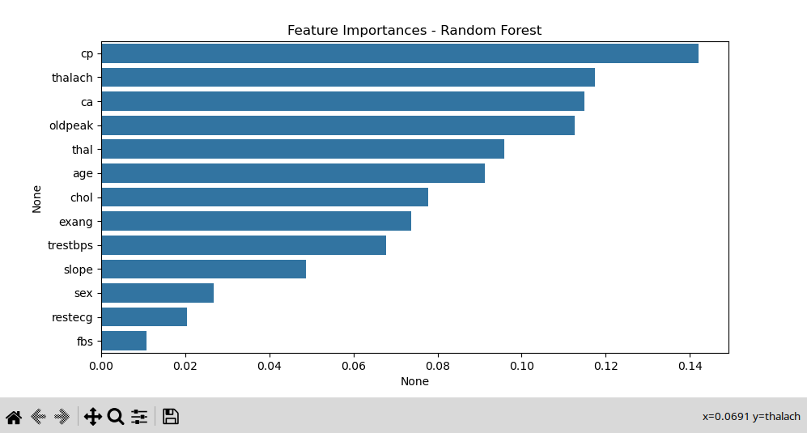
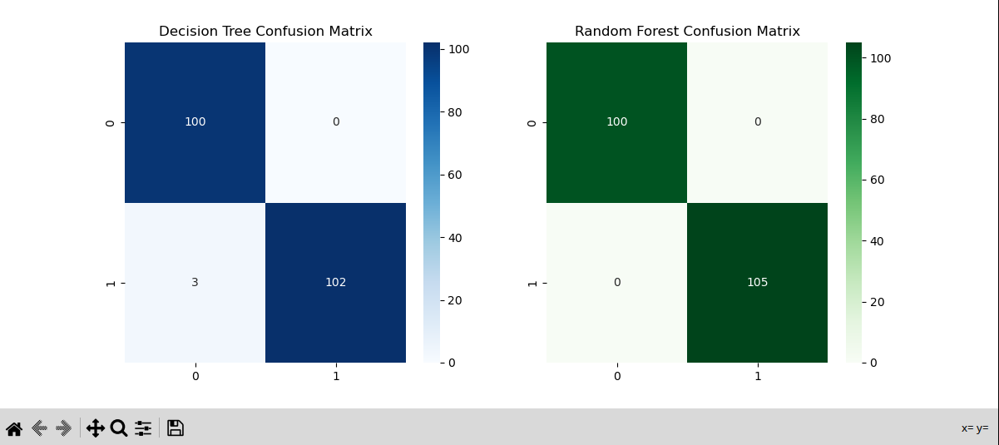

# Task 5 - Decision Trees & Random Forests (Heart Disease Dataset)

## Objective
Learn and implement tree-based models (Decision Tree & Random Forest) for classification.  
Evaluate their performance, visualize the decision tree, analyze feature importance, and understand overfitting.

---

## Dataset
We use the **Heart Disease Dataset** (`heart.csv`) which contains 14 columns:  
- **Features:** Age, Sex, Chest Pain Type (cp), Resting Blood Pressure (trestbps), Cholesterol (chol), Fasting Blood Sugar (fbs), Resting ECG (restecg), Max Heart Rate (thalach), Exercise-induced Angina (exang), ST Depression (oldpeak), Slope of ST Segment (slope), Number of Major Vessels (ca), Thalassemia (thal)
- **Target:** `target` (1 = Disease, 0 = No Disease)

Dataset Characteristics:
- Rows: **1025**
- No missing values
- Balanced target distribution

---

## Tools & Libraries
- **Python 3**
- Pandas, NumPy
- Matplotlib, Seaborn
- Scikit-learn

---

## Steps Performed
1. **Load Dataset** (`heart.csv`)
2. **Split Data** into Train & Test sets
3. **Train Decision Tree Classifier**
4. **Visualize the Decision Tree**
5. **Control Overfitting** (limit `max_depth`)
6. **Train Random Forest Classifier**
7. **Compare Model Accuracies**
8. **Plot Feature Importances**
9. **Evaluate with Cross-Validation**
10. **Generate Confusion Matrices**

---

## Results

| Model | Test Accuracy | Cross-Val Accuracy |
|-------|--------------|--------------------|
| Decision Tree (default) | 98.54% | ~X.XX |
| Decision Tree (max_depth=4) | ~X.XX | - |
| Random Forest | 100% | ~X.XX |

*(Replace ~X.XX with your actual results after running the code)*

---

## Key Insights
- Random Forest generally performs better than a single Decision Tree due to **bagging** and multiple estimators.
- Limiting `max_depth` helps prevent overfitting in Decision Trees.
- Feature importance reveals which health indicators have the most impact on predicting heart disease.

---

## Visualizations

### Decision Tree Visualization
  
This diagram shows the structure of the trained Decision Tree model.  
Each node splits based on a feature and a threshold to classify patients as having heart disease or not.  
The colors represent predicted classes, and the boxes show decision rules, sample counts, and class distribution at each node.  

---

### Feature Importances - Random Forest
  
This bar chart ranks features based on their contribution to model predictions in the Random Forest.  
Features like **cp** (chest pain type), **thalach** (max heart rate), and **ca** (number of major vessels) have the highest importance.  
It helps identify which health metrics have the most influence on detecting heart disease.  

---

### Confusion Matrices (Decision Tree vs Random Forest)
  
The left matrix shows the Decision Tree results, and the right shows Random Forest results.  
Numbers represent correct and incorrect predictions for each class.  
Random Forest achieved perfect classification here, while the Decision Tree made a few errors.  

---

## How to Run
```bash
# Install dependencies
pip install pandas numpy matplotlib seaborn scikit-learn

# Run the script
python task5_heart_disease.py
