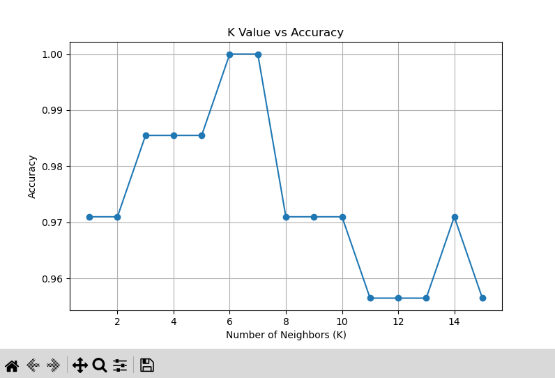
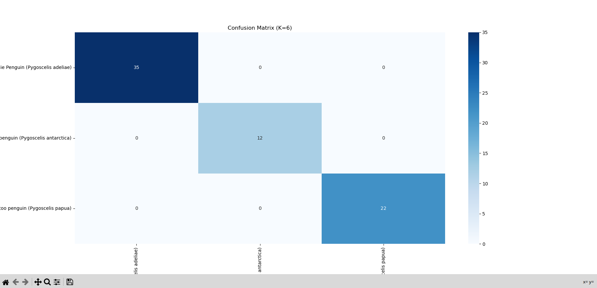

# Penguin Species Classification using KNN

## Overview
This project implements a **K-Nearest Neighbors (KNN)** classification model to predict the **species of penguins** based on their physical measurements.  
The task follows the requirements from **Task 6** in the provided internship guidelines PDF.

## Objective
- Understand and implement **KNN** for a multiclass classification problem.
- Learn the importance of **feature normalization** in distance-based algorithms.
- Experiment with different values of **K** to find the optimal neighbor count.
- Evaluate performance using **accuracy**, **confusion matrix**, and **classification report**.
- Visualize **K vs Accuracy** and confusion matrix.

## Dataset
- **Source:** Palmer Penguins dataset (`Penguindata.csv` provided)
- **Target Variable:** `Species`
- **Features Used:**
  - Culmen Length (mm)
  - Culmen Depth (mm)
  - Flipper Length (mm)
  - Body Mass (g)
- **Classes:**
  - Adelie Penguin (*Pygoscelis adeliae*)
  - Chinstrap Penguin (*Pygoscelis antarctica*)
  - Gentoo Penguin (*Pygoscelis papua*)

## Steps Performed

### **1. Data Preprocessing**
- Dropped rows with missing values in selected columns.
- Encoded target (`Species`) into numeric labels.
- Standardized numeric features using `StandardScaler`.

### **2. Model Training**
- Trained KNN models with `K = 1 to 15`.
- Selected the `K` with the highest accuracy.

### **3. Evaluation**
- Measured accuracy on test data.
- Generated a confusion matrix and classification report.
- Plotted K values vs Accuracy curve.

### **4. Visualization**
- Accuracy vs K plot.
- Confusion matrix heatmap.

## Results
- **Best K:** 6  
- **Test Accuracy:** 100%  
- All classes classified perfectly (dataset is small, so results may be optimistic).

## Visualizations

### **K Value vs Accuracy Plot**
  
This plot shows how the model’s accuracy changes as the number of neighbors (**K**) varies from 1 to 15.  
The accuracy peaks at **K = 6 and K = 7**, reaching **100%**, indicating these values provide the best classification performance for this dataset.  
Very high or very low K values slightly reduce accuracy, showing the importance of tuning K.

### **Confusion Matrix (K = 6)**
  
The confusion matrix illustrates the classification performance for each penguin species.  
All test samples are correctly classified with **zero misclassifications**, as shown by the perfect diagonal alignment.  
This reflects the model’s excellent accuracy for this dataset, although such perfect results may suggest overfitting due to the small sample size.

## Tools & Libraries
- Python
- Pandas
- NumPy
- Matplotlib
- Seaborn
- Scikit-learn

## How to Run
```bash
pip install pandas numpy matplotlib seaborn scikit-learn
python knn_penguins.py
