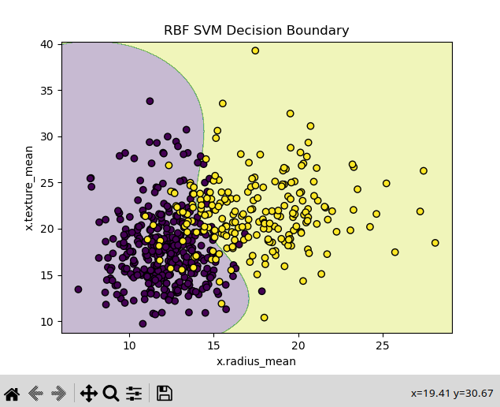
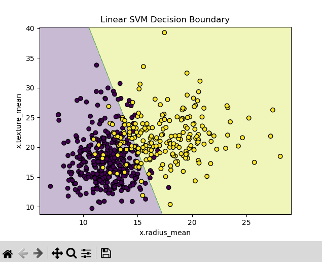

# Breast Cancer Classification using SVM

## Overview
This project implements **Support Vector Machines (SVM)** for binary classification to predict whether a tumor is **Benign (B)** or **Malignant (M)** based on various diagnostic features.  
The task follows the requirements from **Task 7** in the provided internship guidelines PDF.

## Objective
- Understand and implement **SVM** for linear and non-linear classification.
- Learn the effect of **kernel functions** (Linear vs RBF) on decision boundaries.
- Perform **hyperparameter tuning** for `C` and `gamma`.
- Evaluate performance using **cross-validation accuracy**.
- Visualize decision boundaries for both Linear and RBF kernels.

## Dataset
- **Source:** Breast Cancer Wisconsin (Diagnostic) Dataset (`brca.csv` provided)
- **Target Variable:** `y` (`B` = Benign, `M` = Malignant)
- **Features Used for Visualization:**
  - `x.radius_mean`
  - `x.texture_mean`
- **Classes:**
  - Benign Tumor (0)
  - Malignant Tumor (1)

## Steps Performed

### **1. Data Preprocessing**
- Dropped unnecessary index column (`Unnamed: 0`).
- Encoded target labels: `B` → 0, `M` → 1.
- Selected two features for 2D visualization.

### **2. Model Training**
- Created pipelines for:
  - **Linear SVM** (`kernel='linear'`)
  - **RBF SVM** (`kernel='rbf'`)
- Performed **GridSearchCV** for hyperparameter tuning:
  - `C`: `[0.1, 1, 10, 100]`
  - `gamma`: `[0.001, 0.01, 0.1, 1, 'scale']` (RBF only)
- Used **StratifiedKFold** (5 folds) for cross-validation.

### **3. Evaluation**
- Reported **best parameters** for both kernels.
- Reported **cross-validation scores**.
- Compared performance between Linear and RBF kernels.

### **4. Visualization**
- Plotted **decision boundaries** for:
  - Linear SVM
  - RBF SVM

## Results
- **Best Linear SVM Parameters:** `C = 1`
- **Best RBF SVM Parameters:** `C = 100`, `gamma = 0.1`
- **CV Accuracy:**
  - Linear SVM: ~88.18%
  - RBF SVM: ~88.94%
- RBF kernel slightly outperformed Linear in this dataset.

## Visualizations

### **RBF SVM Decision Boundary**
  
The RBF (Radial Basis Function) kernel creates a curved decision boundary that adapts to the data’s non-linear separation.  
It clearly wraps around clusters, allowing the model to capture more complex relationships between `x.radius_mean` and `x.texture_mean`, reducing misclassifications near overlapping regions.

### **Linear SVM Decision Boundary**
  
The Linear kernel produces a straight decision boundary, splitting the data space into two halves.  
While simpler and faster, it may not fully capture the non-linear patterns in the dataset, leading to slightly less flexibility compared to the RBF kernel.

## Tools & Libraries
- Python
- Pandas
- NumPy
- Matplotlib
- Scikit-learn

## How to Run
```bash
pip install pandas numpy matplotlib scikit-learn
python task7_svm.py
