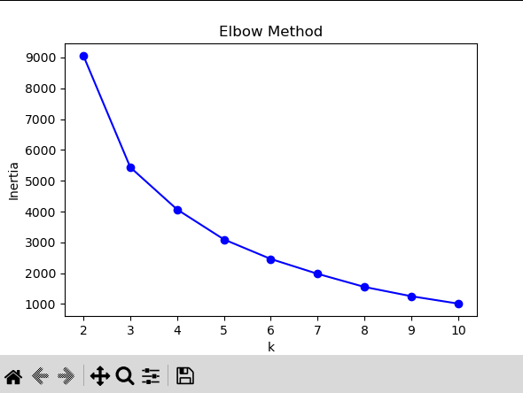
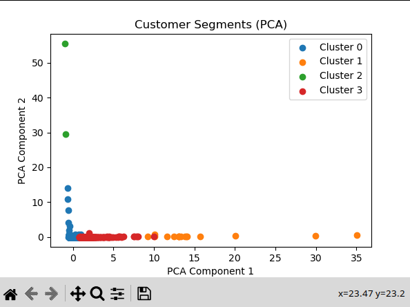

# Customer Segmentation using K-Means Clustering

## Overview
This project implements **K-Means Clustering** to perform **unsupervised customer segmentation** based on purchasing behavior.  
The task follows the requirements from **Task 8** in the provided internship guidelines PDF.

## Objective
- Understand and implement **K-Means** for unsupervised learning.
- Learn the effect of choosing different numbers of clusters.
- Use the **Elbow Method** to find the optimal number of clusters (`k`).
- Evaluate clustering quality using the **Silhouette Score**.
- Visualize customer clusters in **2D** using **PCA**.

## Dataset
- **Source:** `customer_segmentation.csv` (Retail transaction data)
- **Features Used for Clustering:**
  - Number of Transactions per Customer
  - Total Quantity Purchased
  - Average Unit Price
- **Target Variable:** None (Unsupervised Learning)
- **Data Cleaning:**
  - Removed rows with missing `CustomerID`.
  - Aggregated transactions by `CustomerID`.

## Steps Performed

### **1. Data Preprocessing**
- Dropped rows with missing `CustomerID`.
- Grouped data by customer and calculated:
  - **NumTransactions** – Number of unique invoices per customer.
  - **TotalQuantity** – Total items purchased.
  - **AvgUnitPrice** – Average product price purchased.
- Normalized features using **StandardScaler**.

### **2. Finding Optimal k**
- Used **Elbow Method** to plot `k` (2 to 10) vs **inertia**.
- Identified the elbow point as **k = 4**.

### **3. Model Training**
- Fitted **K-Means** with `n_clusters = 4`.
- Assigned each customer to a cluster.
- Saved clustered results in `clustered_customers.csv`.

### **4. Evaluation**
- Calculated **Silhouette Score** to measure cluster separation and cohesion.

### **5. Visualization**
- **Elbow Method Plot** – Shows how inertia changes with `k` to help select optimal clusters.
- **PCA 2D Cluster Plot** – Visualizes customers in 2D space with color-coded clusters.

## Results
- **Optimal k:** 4 (based on Elbow Method)
- **Silhouette Score:** ~0.67 (indicating well-separated clusters)
- Customers are segmented into 4 distinct behavioral groups.

## Visualizations

### **Elbow Method Plot**
  
Shows the relationship between the number of clusters (`k`) and inertia.  
The "elbow" point at **k = 4** indicates a good trade-off between compact clusters and minimal overfitting.

### **PCA Cluster Plot**
  
Displays customer clusters in **2D PCA-reduced space**.  
Each color represents a distinct segment. PCA helps us visualize high-dimensional data while preserving most of its variance.

## Tools & Libraries
- Python
- Pandas
- Matplotlib
- Scikit-learn (KMeans, StandardScaler, Silhouette Score, PCA)

## How to Run
```bash
pip install pandas matplotlib scikit-learn
python task_8.py
